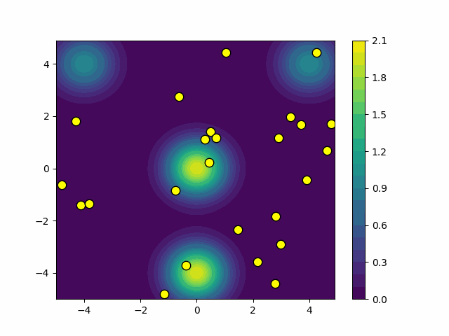

# Algoritmo de las Luciérnagas para Optimización

Este repositorio contiene una implementación del Algoritmo de las Luciérnagas en Python, diseñada para resolver problemas de optimización minimizando una función objetivo. La implementación incluye gráficos que ilustran la convergencia del algoritmo.

## Descripción

El Algoritmo de las Luciérnagas es un algoritmo metaheurístico inspirado en el comportamiento de las luciérnagas, donde la atracción entre luciérnagas es proporcional al brillo (fitness) de las luciérnagas. El objetivo es minimizar una función objetivo moviendo las luciérnagas hacia aquellas que son más brillantes (tienen un menor valor de la función objetivo).

